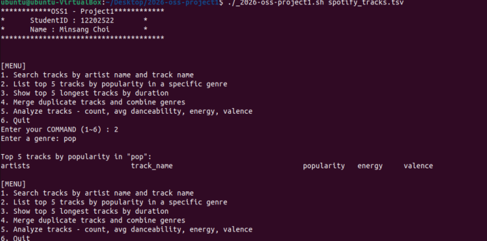

# 2026_OSS_Project1
## 작성자, 실습 환경
- **작성자**: 인하대학교 12202522 최민상
- **실습 환경**: Ubuntu 22.04.5 LTS

## 개요

2026_oss_project1.sh는 Spotify 트랙 데이터 파일(.tsv)을 입력 파일로, 사용자가 메뉴의 번호(1~6)를 입력하여 트랙 정보와 통계적인 분석결과를 받을 수 있는 bash 셸 스크립트입니다.


## 메뉴

1. **Search tracks by artist name and track name** : 아티스트 이름과 트랙 이름을 입력받아 artists, track_name, energy, tempo 정보를 출력합니다.
2. **List top 5 tracks by popularity in a specific genre** : 장르를 입력받아 인기도 기준 상위 5개 트랙을 출력합니다. artists, track_name, popularity, energy, valence를 출력합니다.
3. **Show top 5 longest tracks by duration** : 재생시간 기준 상위 5개 트랙을 출력합니다. artists, track_name, duration을 출력합니다.
4. **Merge duplicate tracks and combine genres** : 2개 이상의 장르에 등록된 트랙을 찾아 장르를 `|` 구분자로 하여 인기도 기준 상위 5개를 출력합니다. track_name, artists, genres를 출력합니다.
5. **Analyze tracks - count, avg danceability, energy, valence** : 인기도 임계값을 입력받아 조건을 만족하는 트랙의 개수와 평균 danceability, energy, valence를 출력합니다.
6. **Quit** : 스크립트를 종료합니다.

---

## 사용방법

1. 스크립트 파일을 저장하세요.

2. 실행 권한을 부여하기 위해 아래와 같이 입력하세요.
    미입력시
    
   ```bash
   chmod u+x 2026-oss-project1.sh
   ```

3. 스크립트 파일을 실행 시, TSV 파일을 인자로 함께 입력해주세요.
   ```bash
   ./2026-oss-project1.sh spotify_tracks.tsv
   ```

4. 인자를 미입력시 오류 메시지가 출력됩니다.
     

5. 메뉴 번호 입력하여 정보를 출력해보세요.

6. 종료하려면 메뉴 번호 6을 입력하세요.

---
## 트러블 슈팅
### 문제상황

메뉴 2번에 장르 입력 시 (예: pop) 올바른 결과가 출력되지 않는 문제가 있었습니다.

### 디버깅
```bash
awk -F'\t' 'NR==2{print "[" $20 "]"}' spotify_tracks.tsv
```
파일의 두 번째 줄 20번째 컬럼(필드)을 대괄호([ ])로 감싸서 출력하여 확인하니, "["가 사라지고 "]acoustic"이 출력되는 것을 확인하였습니다.

### 원인과 해결법
**원인**
해당 오류는 개행 문자 처리 방식의 차이로 인해 발생하였습니다.

spotify_tracks.tsv 파일이 Windows에서 생성된 파일이라 줄바꿈을 `\r\n` (CRLF)을 사용하지만, 실습환경인 Linux 환경에서는 `\n`(LF)만 표준으로 인식하여 발생한 문제였습니다.

**해결법**
- `gsub(/\r/, "")`
awk의 **전역 치환 함수**로 현재 줄이나 특정 변수에서 모든 `\r` 문자를 찾아 빈 문자열(`""`)로 바꿔서 데이터 끝에 붙은 `\r`을 먼저 제거한 뒤 안전하게 처리하였습니다.

**문법**
- `gsub`은 패턴과 일치하는 모든 부분을 찾아 바꿈
- `/\r/`은 찾을 대상인 정규 표현식
- `""`은 바꿀 내용으로 빈 따옴표를 사용하여, 삭제하라는 의미

---

## 참고 문법

### awk
- 내장변수 : `NF`는 필드 개수, `NR`는 행 번호
- awk에서 변수를 선언 없이 처음 사용하면 자동으로 초기화 (숫자로 쓰면 0으로, 문자로 쓰면 ""로 초기화 됨)
- `count++`은 `count`는 자동으로 0으로 초기화된 뒤 1이 됨
- `awk -F'\t'` 는 tsv 파일은 각 열이 탭으로 구분되어 있어, 탭을 필드 구분자로 지정
- `awk -v` 는 외부변수를 awk 내부에서  사용할 수 있는 변수로 가져옴
- `NR > 1` 는 첫 번째 행인 헤더를 건너뛰고 데이터가 있는 행부터 처리
- `%d`는 정수 표현, `%f`는 실수 표현, `%s`는 문자열 표현
- `%s`는 칸 확보 없이 데이터 길이만큼만 출력
- `%6s`는 6칸 확보 후 오른쪽 정렬
- `%-6s`는 6칸 확보 후 왼쪽 정렬
- `%02d`는 숫자 출력시 빈 공간을 공백 대신 0으로 채움
- `BEGIN`은 스크립트에서 데이터를 읽기 전에 한 번만 실행되는 특수 패턴 블록
- `END`는 모든 줄을 다 읽은 후 마지막 한 번만 실행되는 특수 패턴 블록
- `tolower()` 는 문자열을 소문자로 변환
- `$5 + 0`는 필드가 문자열로 인식되지 않도록 명시적으로 숫자형으로 변환
- `index(str, sub)`는 문자열 안에서 `sub`을 찾아 시작 위치를 반환, 없으면 0 반환
- `index(genres[key], $20) == 0` 으로 이미 추가된 장르인지 확인, 중복 장르 추가 방지
- ` for (key in arr)`는 배열 순회 문법으로 배열에 저장된 모든 키를 순서대로 꺼내서 key에 넣고 반복 실행
- `split(str, arr, sep)`는 문자열을 구분자로 나누어 배열에 저장
- `split(key, parts, "\t")`로 tab으로 합쳐진 키를 다시 분리
- `!seen[key]++` 는 같은 key가 처음 나올 때만 true로 하고 동시에 ++로 1이 되어 다음 등장부턴 false로 하여, 중복 출력 방지

**참고**: https://www.gnu.org/software/gawk/manual/gawk.html

### sort
- 데이터를 정렬하는 명령어
- `-t$'\t'` : 탭을 필드 구분자로 지정
- `-k3` : 3번째 필드를 기준으로 정렬
- `-n` : 숫자 기준 정렬
- `-r` : 내림차순 정렬
- `-nr`: 숫자를 내림차순으로 정렬


---